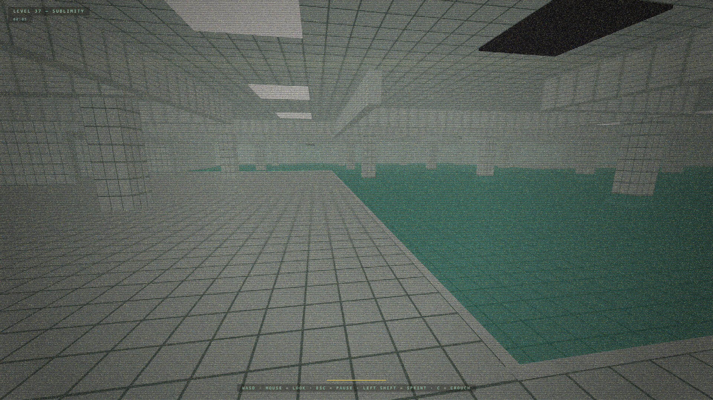

# Backrooms

Backrooms game written in Three.js, with procedural maze generation, monster AI, and mobile support.

**Live demo:** https://szabolevi98.github.io/backrooms

## Controls

| Input | Action |
|---|---|
| `WASD` | Move |
| Mouse | Look |
| `Left Shift` | Sprint |
| `C` | Crouch (duck under hanging walls) |
| `M` | Mute / Unmute |
| `ESC` | Pause |

## Levels

Pick a level from the main menu — your best survival time per level is saved locally and shown next to it.

| Level 0 — The Lobby | Level 37 — Sublimity |
|:---:|:---:|
|  |  |
| the classic yellow mono-rooms | the flooded white-tiled poolrooms |
